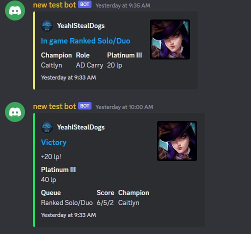

# lol-tracker

A Discord bot to track your friends' League of Legends wins and losses in real time.

This bot currently scrapes [League of Graphs](https://www.leagueofgraphs.com/) and will notify a Discord channel when a user starts or completes a game. See `src/leagueofgraphs_api/mod.rs` for details.

Alternative LoL data sources can be added by implementing the `ApiStrategy` trait and replacing `strategy` in `main.rs`.

### Tools Used

- [Rust](https://www.rust-lang.org/)
- [Serenity](https://github.com/serenity-rs/serenity)
- [sqlx](https://github.com/launchbadge/sqlx)
- [SQLite](https://www.sqlite.org/index.html)

## Usage

| Command    | Description                                                             |
| ---------- | ----------------------------------------------------------------------- |
| init       | Initialize the chat channel to receive notifications (this is required) |
| addUser    | Add a user by summoner name.                                            |
| removeUser | Remove user.                                                            |

## How to use with Docker

- add your bot token to `docker-compose.yml`
- run `docker compose up`
- [Adding your bot to servers](https://discordjs.guide/preparations/adding-your-bot-to-servers.html#bot-invite-links)

## Example Alerts



## Limitations

Currently the bot only works for NA accounts.

### Database notes

SQLX

```
cargo install sqlx-cli
touch db.sqlite
cargo sqlx migrate run
cargo sqlx prepare
```

Migrations

```
cargo sqlx migrate add <name>
cargo sqlx migrate revert <name>
```

## Todo

- accounts for all regions
- list all users command
- logs command
- add autofill discord commands?
- game history command
- 24 hour snapshot command
